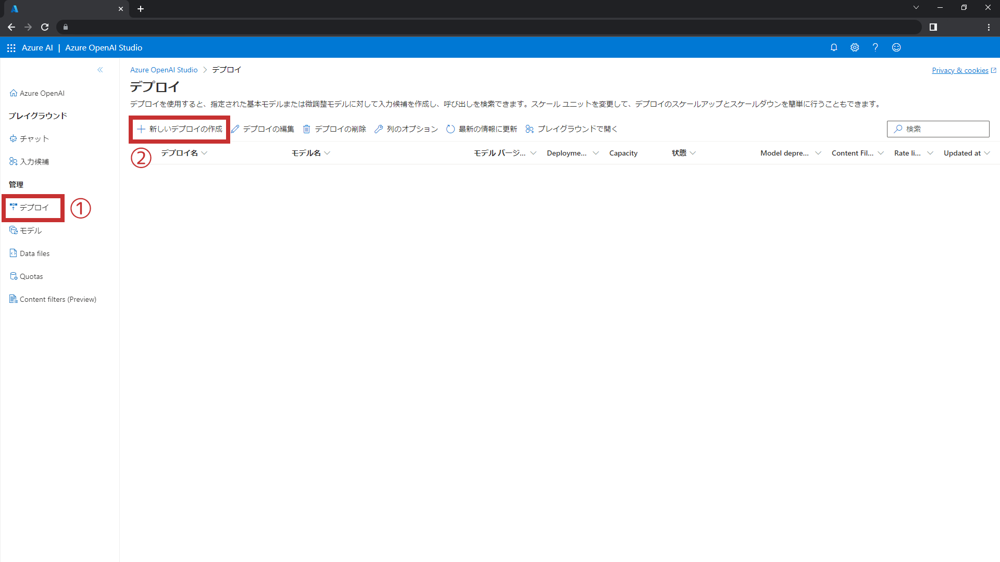
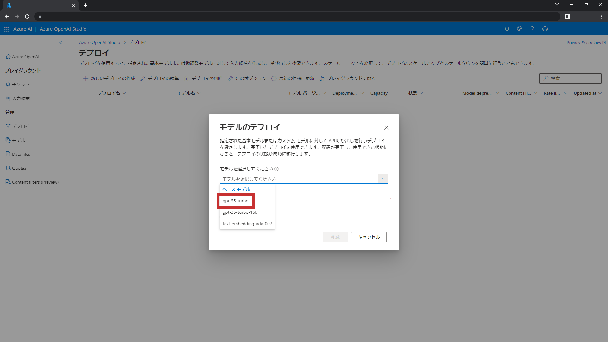
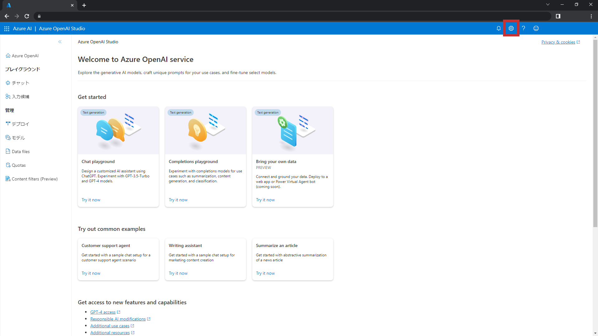
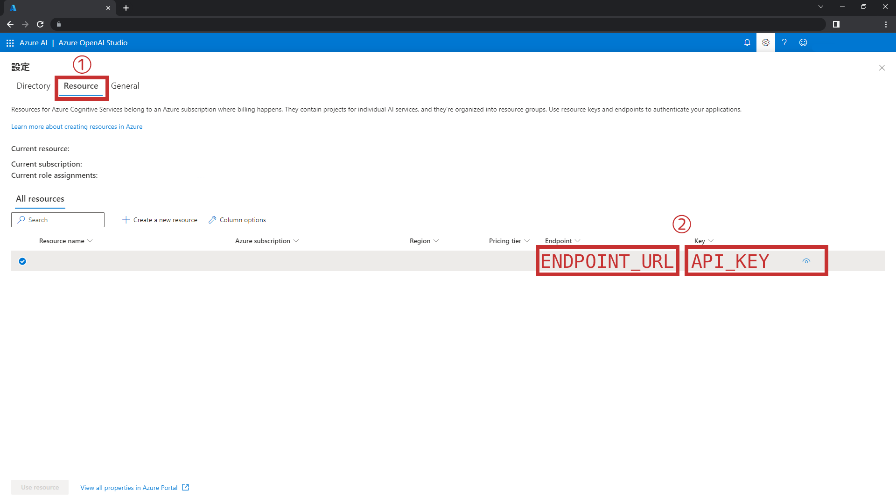

# PullRequest Code Reviewer for Azure
このActionsはプルリクエスト内の差分ファイルに対し、Azure OpenAI Serviceを用いてコードレビューを行います。
主に以下の機能を提供します。
- **変更点の要約** - 差分ファイルの変更箇所がどのように変更されたのかを要約します。
- **改善点の提案** - コードに改善の余地がある場合、改善案を提案します。
- **コードの賞賛** - コードに改善点がない場合、AIアシスタントがあなたを褒めてくれます。

# 使用方法
## Inputs
- `api-key` - Azure OpenAI サービスにアクセスするためのキーを参照します。
- `endpoint-url` - Azure OpenAI サービスのURLを参照します。
> **Note**
> Inputsの値はSecretsに保存した値を呼び出すようにしてください。

## 手順
1. Azure OpenAI リソースの作成
    1. Azure OpenAIへのアクセスを申し込んでいない場合、[公式ドキュメント](https://learn.microsoft.com/ja-jp/azure/cognitive-services/openai/overview#how-do-i-get-access-to-azure-openai)を参照し、手続きを行ってください。
    2. Azure PortalやAzure CLIを使用し、Azure OpenAI リソースを作成してください。

2. モデルのデプロイ
    1. 作成したAzure OpenAI リソースの詳細を開き、`探索` をクリックし、Azure OpenAI Studioへアクセスします。
        
    2. `デプロイ` タブに切り替え、`新しいデプロイの作成` をクリックします。
        
    3. `gpt-35-turbo` モデルを選択し、デプロイします。
        

3. Secretの設定
    1.  Azure OpenAI Studio にアクセスし、右上の歯車アイコンをクリックします。
        
    2.  `Resource` タブに切り替え、`Endpoint`、`Key` の値を控えておきます。
        
    3.  先ほどの `Endpoint`、`Key` をそれぞれ以下の表の通りにSecretsに登録します。
        | Name | Secret |
        | - | - |
        | ENDPOINT_URL | `Endpoint` |
        | API_KEY | `Key` |

4. ワークフローの作成
    1.  `.github/workflows/<任意の名前>.yml` を作成します。
    2.  以下のコードを記述します。
        ```yml
        name: <任意のワークフロー名>
        on:
            pull_request:
                types: [opened, reopened]
        jobs:
            <任意のジョブ名>:
                runs-on: ubuntu-latest
                permissions:
                    contents: read
                    pull-requests: write
                steps:
                  - name: PullRequest Code Reviewer for Azure
                    uses: alterbooth/pullrequest-code-reviewer-for-azure@v1
                    with:
                        api-key: {{ secrets.API_KEY }}
                        endpoint-url: {{ secrets.ENDPOINT_URL }}
        ```

5. レビュー対象定義ファイルの作成
    1.  リポジトリのルートディレクトリに `.reviewfiles` を作成します。
    2.  レビュー対象のファイル拡張子を記載します。
        記載例は以下のコードになります。
        ```yml
        .py
        .java
        .json
        .config
        ```
        > **Warning**
        > `.reviewfiles` には拡張子以外の記述を行わないでください。

# ライセンス
このプロジェクトは[MIT License](LICENSE)の下で配布されています。